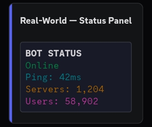
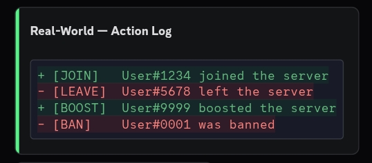
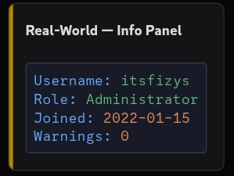
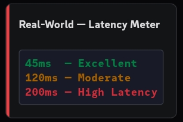
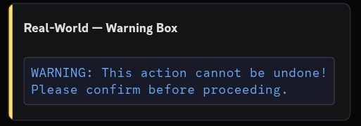

# Real-World Examples

Ready-to-use color formatting patterns for common bot command use cases.

---

## 1. Status Block — Success / Error / Warning / Info

A clean colored status indicator using ANSI:



```js
const { TextDisplayBuilder, ContainerBuilder, SeparatorBuilder, SeparatorSpacingSize, MessageFlags } = require('discord.js');

const ESC = '\u001b';

function statusBlock(type, message) {
  const styles = {
    success: ESC + '[0;32m  SUCCESS  ' + ESC + '[0m',
    error:   ESC + '[0;31m  ERROR    ' + ESC + '[0m',
    warning: ESC + '[0;33m  WARNING  ' + ESC + '[0m',
    info:    ESC + '[0;36m  INFO     ' + ESC + '[0m',
  };

  return '```ansi\n' + (styles[type] || styles.info) + '  ' + message + '\n```';
}

// Usage in a command:
const container = new ContainerBuilder()
  .setAccentColor(0x5BC8F5)
  .addTextDisplayComponents(
    new TextDisplayBuilder().setContent(statusBlock('success', 'User banned successfully')),
    new TextDisplayBuilder().setContent(statusBlock('error', 'Insufficient permissions')),
    new TextDisplayBuilder().setContent(statusBlock('warning', 'This action cannot be undone')),
    new TextDisplayBuilder().setContent(statusBlock('info', 'Audit log entry created')),
  );

await interaction.reply({
  components: [container],
  flags: MessageFlags.IsComponentsV2,
});
```

---

## 2. Diff-Style Action Log

Using `diff` blocks to show what changed — green for added, red for removed:



```js
const { TextDisplayBuilder, ContainerBuilder, SeparatorBuilder, SeparatorSpacingSize, MessageFlags } = require('discord.js');

const changes = {
  added: ['Admin', 'Moderator'],
  removed: ['Member', 'Verified'],
};

const lines = [
  ...changes.added.map(r => `+ ${r}`),
  ...changes.removed.map(r => `- ${r}`),
];

const container = new ContainerBuilder()
  .setAccentColor(0x5865F2)
  .addTextDisplayComponents(
    new TextDisplayBuilder().setContent('### Role Changes')
  )
  .addSeparatorComponents(
    new SeparatorBuilder().setDivider(true).setSpacing(SeparatorSpacingSize.Small)
  )
  .addTextDisplayComponents(
    new TextDisplayBuilder().setContent('```diff\n' + lines.join('\n') + '\n```')
  );

await interaction.reply({
  components: [container],
  flags: MessageFlags.IsComponentsV2,
});
```

---

## 3. YAML-Style Info Panel

Using `yaml` blocks to present key-value data with colored labels:



```js
const { TextDisplayBuilder, ContainerBuilder, SeparatorBuilder, SeparatorSpacingSize, MessageFlags } = require('discord.js');

function yamlBlock(fields) {
  const lines = Object.entries(fields).map(([k, v]) => `${k}: ${v}`);
  return '```yaml\n' + lines.join('\n') + '\n```';
}

const container = new ContainerBuilder()
  .setAccentColor(0x5BC8F5)
  .addTextDisplayComponents(
    new TextDisplayBuilder().setContent('### Server Info')
  )
  .addSeparatorComponents(
    new SeparatorBuilder().setDivider(true).setSpacing(SeparatorSpacingSize.Small)
  )
  .addTextDisplayComponents(
    new TextDisplayBuilder().setContent(yamlBlock({
      Name:    interaction.guild.name,
      Members: interaction.guild.memberCount,
      Region:  'Auto',
      Boost:   `Level ${interaction.guild.premiumTier}`,
      Owner:   `<@${interaction.guild.ownerId}>`,
    }))
  );

await interaction.reply({
  components: [container],
  flags: MessageFlags.IsComponentsV2,
});
```

---

## 4. Ping / Network Result with ANSI color-coded latency

Color the latency value based on how fast it is:



```js
const { TextDisplayBuilder, ContainerBuilder, SeparatorBuilder, SeparatorSpacingSize, MessageFlags } = require('discord.js');

const ESC = '\u001b';

function colorLatency(ms) {
  if (ms < 80)  return ESC + '[0;32m' + ms + 'ms' + ESC + '[0m'; // green
  if (ms < 150) return ESC + '[0;33m' + ms + 'ms' + ESC + '[0m'; // yellow
  return               ESC + '[0;31m' + ms + 'ms' + ESC + '[0m'; // red
}

const wsPing  = interaction.client.ws.ping;
const apiPing = Date.now() - interaction.createdTimestamp;

const output = [
  '```ansi',
  'Websocket  ' + colorLatency(wsPing),
  'API        ' + colorLatency(apiPing),
  '```',
].join('\n');

const container = new ContainerBuilder()
  .setAccentColor(0x5BC8F5)
  .addTextDisplayComponents(
    new TextDisplayBuilder().setContent('### Ping'),
    new TextDisplayBuilder().setContent(output),
  );

await interaction.reply({
  components: [container],
  flags: MessageFlags.IsComponentsV2,
});
```

---

## 5. IP Lookup with Mixed Blocks

Using `yaml` for labeled fields and `diff` for a status line:

```js
const { TextDisplayBuilder, ContainerBuilder, SeparatorBuilder, SeparatorSpacingSize, MessageFlags } = require('discord.js');

async function ipLookupCommand(interaction, ip) {
  const data = await fetchIpData(ip); // your lookup function

  const infoBlock = [
    '```yaml',
    `IP:       ${data.ip}`,
    `Country:  ${data.country}`,
    `Region:   ${data.region}`,
    `City:     ${data.city}`,
    `ISP:      ${data.isp}`,
    `ASN:      ${data.asn}`,
    '```',
  ].join('\n');

  const statusLine = data.proxy
    ? '```diff\n- Proxy / VPN detected\n```'
    : '```diff\n+ Clean IP — no proxy detected\n```';

  const container = new ContainerBuilder()
    .setAccentColor(0x5BC8F5)
    .addTextDisplayComponents(
      new TextDisplayBuilder().setContent(`### IP Lookup — \`${ip}\``)
    )
    .addSeparatorComponents(
      new SeparatorBuilder().setDivider(true).setSpacing(SeparatorSpacingSize.Small)
    )
    .addTextDisplayComponents(
      new TextDisplayBuilder().setContent(infoBlock),
      new TextDisplayBuilder().setContent(statusLine),
    );

  await interaction.reply({
    components: [container],
    flags: MessageFlags.IsComponentsV2,
  });
}
```

---

## 6. Warning Box with fix Block

Using `fix` to make a standout all-orange warning:



```js
const { TextDisplayBuilder, ContainerBuilder, SeparatorBuilder, SeparatorSpacingSize, MessageFlags } = require('discord.js');

const container = new ContainerBuilder()
  .setAccentColor(0xFF8C00)
  .addTextDisplayComponents(
    new TextDisplayBuilder().setContent('### Action Required')
  )
  .addSeparatorComponents(
    new SeparatorBuilder().setDivider(true).setSpacing(SeparatorSpacingSize.Small)
  )
  .addTextDisplayComponents(
    new TextDisplayBuilder().setContent(
      '```fix\n' +
      'Your trial expires in 24 hours\n' +
      'Renew your subscription to avoid interruption\n' +
      '```'
    )
  );

await interaction.reply({
  components: [container],
  flags: MessageFlags.IsComponentsV2 | MessageFlags.Ephemeral,
});
```

---

## 7. Full Slash Command — ANSI Color Showcase

A complete slash command file demonstrating all colors:

```js
const { SlashCommandBuilder, ContainerBuilder, TextDisplayBuilder,
  SeparatorBuilder, SeparatorSpacingSize, MessageFlags } = require('discord.js');

const ESC = '\u001b';

module.exports = {
  data: new SlashCommandBuilder()
    .setName('colors')
    .setDescription('Show all ANSI colors'),

  async execute(interaction) {
    const fgBlock = [
      '```ansi',
      ESC + '[0;30m  Dark Gray (30) ' + ESC + '[0m',
      ESC + '[0;31m  Red (31)       ' + ESC + '[0m',
      ESC + '[0;32m  Green (32)     ' + ESC + '[0m',
      ESC + '[0;33m  Yellow (33)    ' + ESC + '[0m',
      ESC + '[0;34m  Blurple (34)   ' + ESC + '[0m',
      ESC + '[0;35m  Pink (35)      ' + ESC + '[0m',
      ESC + '[0;36m  Cyan (36)      ' + ESC + '[0m',
      ESC + '[0;37m  White (37)     ' + ESC + '[0m',
      '```',
    ].join('\n');

    const bgBlock = [
      '```ansi',
      ESC + '[40m  Firefly Dark Blue (40) ' + ESC + '[0m',
      ESC + '[41m  Orange (41)            ' + ESC + '[0m',
      ESC + '[42m  Marble Blue (42)       ' + ESC + '[0m',
      ESC + '[43m  Greyish Teal (43)      ' + ESC + '[0m',
      ESC + '[44m  Gray (44)              ' + ESC + '[0m',
      ESC + '[45m  Indigo (45)            ' + ESC + '[0m',
      ESC + '[46m  Light Gray (46)        ' + ESC + '[0m',
      ESC + '[47m  White (47)             ' + ESC + '[0m',
      '```',
    ].join('\n');

    const container = new ContainerBuilder()
      .setAccentColor(0x5BC8F5)
      .addTextDisplayComponents(
        new TextDisplayBuilder().setContent('## ANSI Color Reference')
      )
      .addSeparatorComponents(
        new SeparatorBuilder().setDivider(true).setSpacing(SeparatorSpacingSize.Small)
      )
      .addTextDisplayComponents(
        new TextDisplayBuilder().setContent('### Foreground Colors'),
        new TextDisplayBuilder().setContent(fgBlock),
      )
      .addSeparatorComponents(
        new SeparatorBuilder().setDivider(true).setSpacing(SeparatorSpacingSize.Small)
      )
      .addTextDisplayComponents(
        new TextDisplayBuilder().setContent('### Background Colors'),
        new TextDisplayBuilder().setContent(bgBlock),
      )
      .addTextDisplayComponents(
        new TextDisplayBuilder().setContent('-# ANSI renders on Desktop and Web only')
      );

    await interaction.reply({
      components: [container],
      flags: MessageFlags.IsComponentsV2,
    });
  },
};
```
