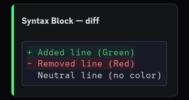
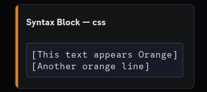
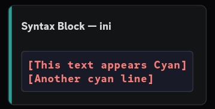
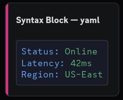
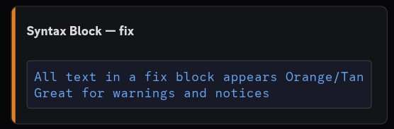
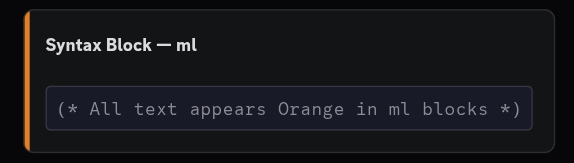

# Syntax Blocks

Discord runs **highlight.js** on every code block. By using specific language tags you can get colored text without any ANSI escape codes. These work on **all platforms** including mobile.

---

## diff — Green and Red lines

Lines prefixed with `+` render green, lines prefixed with `-` render red.

````
```diff
+ This line is green
- This line is red
  This line has no color
```
````



**In a bot command:**

```js
const output = [
  '```diff',
  '+ SUCCESS  User banned',
  '- ERROR    No permission',
  '  INFO     Audit log updated',
  '```',
].join('\n');
```

**Rules:**
- Line starts with `+` → green
- Line starts with `-` → red
- Any other line → default (no color)

---

## css — Orange for bracketed text

Wrap text in `[ ]` inside a `css` block to get orange.

````
```css
[This text is orange]
This text has no color
```
````



**In a bot command:**

```js
const output = [
  '```css',
  '[Status: Online]',
  '[Region: US East]',
  '```',
].join('\n');
```

**Rules:**
- Text inside `[ ]` → orange
- Everything else → default

---

## ini — Cyan/Teal for bracketed text

Same bracket syntax as `css`, but gives cyan/teal instead of orange.

````
```ini
[This text is cyan]
This text has no color
```
````



**In a bot command:**

```js
const output = [
  '```ini',
  '[Network Info]',
  '[IP: 192.168.1.1]',
  '```',
].join('\n');
```

**Rules:**
- Text inside `[ ]` → cyan/teal
- Everything else → default

> `css` and `ini` both use brackets but produce different colors — `css` = orange, `ini` = cyan.

---

## yaml — Pink keys, White values

The `key:` part (before the colon) renders pink/red, the value after the colon renders white.

````
```yaml
status: online
region: us-east
uptime: 99.9%
```
````



**In a bot command:**

```js
const fields = {
  Status: 'Online',
  Region: 'US East',
  Ping: '42ms',
};

const lines = Object.entries(fields).map(([k, v]) => `${k}: ${v}`);

const output = ['```yaml', ...lines, '```'].join('\n');
```

**Rules:**
- `key:` part (before the colon) → pink/red
- Value (after the colon) → white/default

---

## fix — Orange for everything

Every line in a `fix` block renders orange. No special syntax needed.

````
```fix
This entire block is orange
Every single line in here
No prefixes or brackets required
```
````



**In a bot command:**

```js
const output = [
  '```fix',
  'WARNING: Rate limit approaching',
  'Action required before 5 minutes',
  '```',
].join('\n');
```

**Rules:**
- All text → orange/tan
- No special syntax required

---

## ml — Orange for ** wrapped text

Text wrapped in `** **` inside an `ml` block renders orange.

````
```ml
** This text is orange **
This text has no color
```
````



**In a bot command:**

```js
const output = [
  '```ml',
  '** ALERT: Server overloaded **',
  'Normal info text here',
  '```',
].join('\n');
```

**Rules:**
- Text between `** **` → orange
- Everything else → default

---

## Summary

| Language | What gets colored | Color |
|----------|------------------|-------|
| `diff` | Lines starting with `+` | Green |
| `diff` | Lines starting with `-` | Red |
| `css` | Text inside `[ ]` | Orange |
| `ini` | Text inside `[ ]` | Cyan |
| `yaml` | The `key:` part | Pink/Red |
| `fix` | Everything | Orange |
| `ml` | Text between `** **` | Orange |
